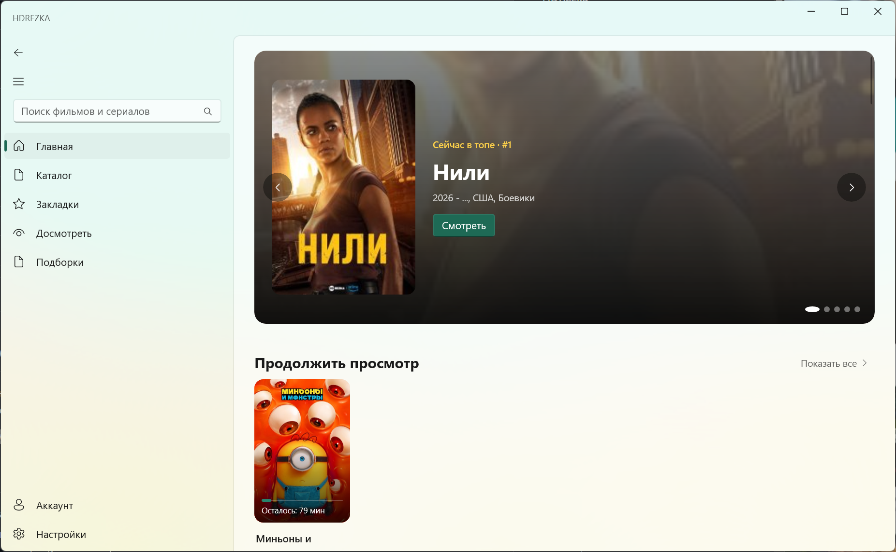
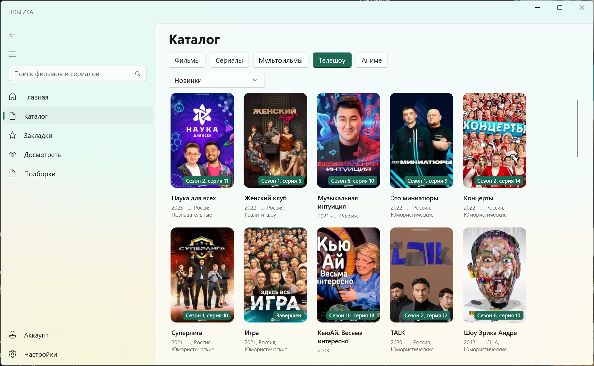
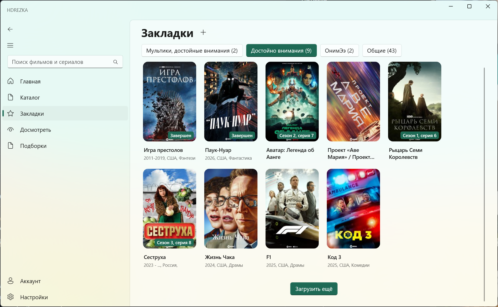
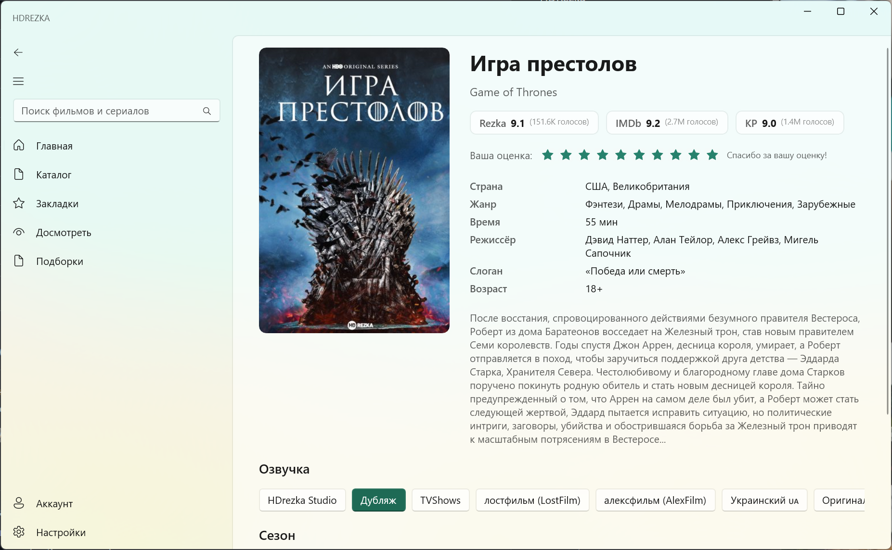
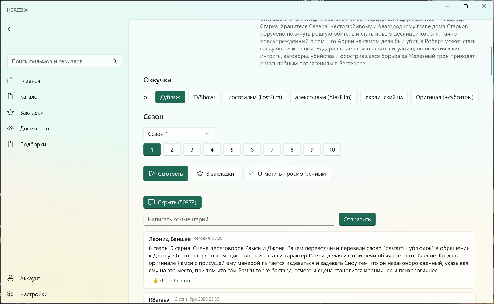
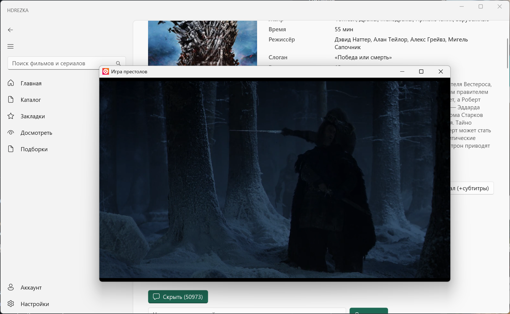
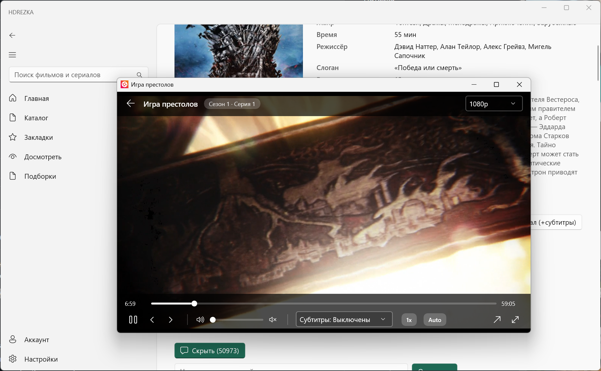

# HDREZKA for Windows

Неофициальный клиент HDRezka для Windows: каталог фильмов, сериалов, мультфильмов и аниме, онлайн-просмотр, закладки, история, комментарии и оценки.

  

## Контакты для связи:
- Группа в Telegram: https://t.me/hdrezkawin
- Threads: https://www.threads.com/@ados86rus?invite=0

## Возможности

- **Главная** — hero-карусель топа недели, подборки новинок, популярного и ожидаемого
- **Каталог** — фильмы, сериалы, мультфильмы, шоу и аниме с фильтрами и бесконечной прокруткой
- **Поиск** — по названию (от 2 символов)
- **Детали** — описания, рейтинги Rezka/IMDb/KP, озвучки, сезоны и серии, трейлеры
- **Видеоплеер** — нативное воспроизведение в отдельном окне, полноэкранный режим, качество, субтитры, скорость, zoom, запоминание позиции, открытие во внешнем плеере
- **Досмотреть** — локальная история + синхронизация с аккаунтом, удаление записей, ряд «Продолжить просмотр» на главной
- **Просмотрено** — отметки о просмотре для фильмов и серий, работают даже без аккаунта
- **Закладки** — категории сайта + создание и удаление своих категорий
- **Подборки** — коллекции сайта (по годам, жанрам, студиям)
- **Комментарии** — просмотр, ответы, лайки, отправка
- **Оценки** — голосование за фильмы и сериалы (1–10)
- **Аккаунт** — вход, профиль, выход
- **Персонализация** — тема (системная/светлая/тёмная), язык (русский/English/українська), размер постеров, зеркало сайта с автоматическим подбором рабочего

## Скриншоты









## Системные требования

- Windows 10 версии 19041+ / Windows 11, x64
- Отдельная установка Windows App SDK **не требуется** (self-contained сборка)

## Установка

1. Скачайте `HDREZKA-Setup-1.2.0.exe` из раздела [Releases](../../releases).
2. Запустите и укажите папку установки.
3. Ярлыки появятся в меню «Пуск» (и на рабочем столе — опционально).

## Сборка из исходников

```bash
# Debug-сборка
dotnet build src/HDREZKA.App/HDREZKA.App.csproj

# Запуск
dotnet run --project src/HDREZKA.App/HDREZKA.App.csproj

# Тесты
dotnet test tests/HDREZKA.Tests/HDREZKA.Tests.csproj

# Релизная публикация (папка для установщика)
dotnet publish src/HDREZKA.App/HDREZKA.App.csproj -c Release
```

Требуется .NET 8 SDK (или новее).

### Установщик

Скрипт Inno Setup лежит в `installer/installer.iss`. Для сборки `Setup.exe`:

1. Опубликуйте релиз (команда выше).
2. Установите [Inno Setup 6](https://jrsoftware.org/isinfo.php).
3. Откройте `installer/installer.iss` и нажмите Compile.

## Структура

```
src/
  HDREZKA.App/      # WinUI 3 приложение (XAML + C#)
    Views/          # Страницы: Home, Catalog, Search, Details, Player, Bookmarks, ...
    Controls/       # Переиспользуемые карточки
    Services/       # Настройки, сеть, локализация, навигация
  HDREZKA.Core/     # API-клиент сайта, парсеры
tests/
  HDREZKA.Tests/    # Юнит-тесты парсеров
installer/
  installer.iss     # Скрипт установщика (Inno Setup 6)
```

## Дисклеймер

Неофициальный клиент. Приложение не хранит и не распространяет контент, а лишь предоставляет доступ к общедоступным данным сайта. Используйте на свой страх и риск.

## Донаты

Если приложение полезно — поддержите разработку донатом в TON (принимаются любые токены сети TON):

```
UQBNd1gXEZi4oahqNeJEy18KCUXfVvmBnPgXlokPpzU_PbFQ
```

QR-код — в разделе «Настройки → Поддержать проект».

## Лицензия

MIT License, Copyright (c) 2026. Текст на русском, английском и украинском — в [LICENSE.md](LICENSE.md).
